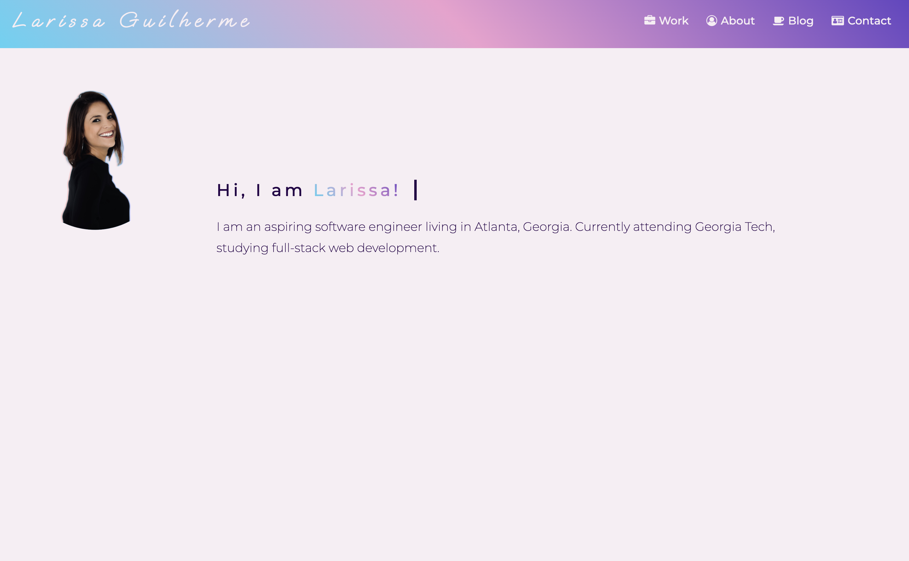

# Portfolio

## Description
I'm an aspiring software engineer living in Atlanta, Georgia. Currently attending Georgia Tech, studying full-stack web development.

## Installation

No installation is required. Simply click on the link below to access the website.

>[$ git pull origin larissa](https://larigens.github.io/portfolio/)

## Visuals

## Usage

The links in the navigation bar lead you to more detailed sections of this site, where you will find more information about me.

## Credits

Resources used during the development of this portfolio:

- [Make a README](https://www.makeareadme.com)

- [W3 Schools](https://www.w3schools.com)

- [MDN](https://developer.mozilla.org/en-US/)

- [FrontEnd Trend](https://linktr.ee/frontend_trend)

## License

Please refer to the [LICENSE](https://choosealicense.com/licenses/mit/) in the repo.
