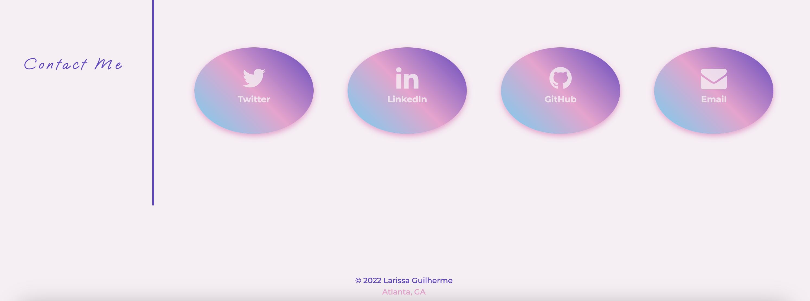

# Larissa Guilherme - Portfolio

## Description
 I am an aspiring software engineer living in Atlanta, GA and currently studying full-stack web development at Georgia Tech.

This portfolio is a showcase of the skills and abilities that I have developed, so that an employer can assess whether I am a good candidate for an open position.

## Installation

No installation is required. Simply click on the link below to access the website.

 [$ git pull origin larissa](https://larigens.github.io/) 

## Mock-Up

The following image shows the web application's appearance and functionality:




## Usage/Examples

```javascript
The links in the navigation bar leads you to more detailed sections of this site, where you will find more information about me, my work and how to contact me.
```

```javascript
It has a clean and polished and responsive user interface that adapts to various screen sizes, so feel free to use it on your smartphone or tablet.
```

## Support

For support, email larigens@gmail.com.

## Acknowledgements

Resources used during the development of this portfolio:

- [Make a README](https://www.makeareadme.com)

- [W3 Schools](https://www.w3schools.com)

- [MDN](https://developer.mozilla.org/en-US/)

- [FrontEnd Trend](https://linktr.ee/frontend_trend)

## Feedback

If you have any feedback, please contact me at larigens@gmail.com.

## 🔗 Links

[](https://www.linkedin.com/in/lari-gui/)
[](https://twitter.com/coffeebr_eak)

## License

Please refer to the [LICENSE](https://choosealicense.com/licenses/mit/) in the repo.
