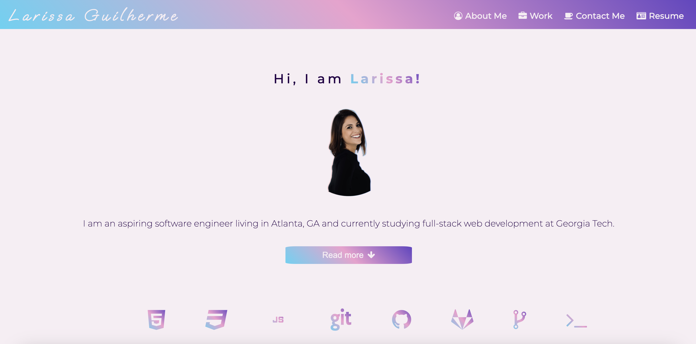
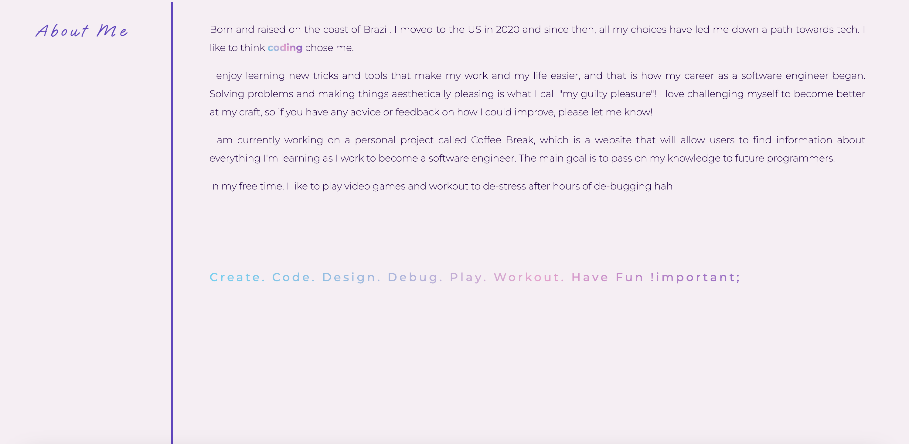

<h1 align="center"> Larissa Guilherme </h1>

  
   
  <i>Portfolio</i>
   

  <a href="https://larigens.github.io/lari-gui"><strong>Larissa Guilherme</strong></a>

  Scan the QR code:

  
   

 

---
## Description

I am an aspiring software engineer living in Atlanta, GA and currently studying full-stack web development at Georgia Tech.

This portfolio is a showcase of the skills and abilities that I have developed throughout the bootcamp.

## Table of Contents
- [Description](#description)
- [Table of Contents](#table-of-contents)
- [Mock-Up](#mock-up)
- [Usage](#usage)
- [Questions](#questions)
- [Contributions](#contributions)
  - [Contributing Guidelines](#contributing-guidelines)
  - [Code of Conduct](#code-of-conduct)
- [Credits](#credits)
  - [Acknowledgements](#acknowledgements)
  - [Links](#links)
- [License](#license)

## Mock-Up

The following images shows the web application's appearance and functionality:

## Usage

The links in the navigation bar leads you to more detailed sections of this website, where you will find more information about me, my work and how to contact me.

It has a responsive user interface that adapts to various screen sizes!

**Feel free to use it on your smartphone or tablet.**

## Questions

For questions and support feel free to contact me via:
<a href="mailto:larigens@gmail.com">📧 Email </a>
<a href="https://github.com/${github}">🐈‍⬛ GitHub </a>

## Contributions
### Contributing Guidelines

Want to report a bug, contribute some code, or improve the documentation? You can submit an issue and I will gladly welcome you as a contributor, but before submitting an issue, please search the issue tracker, as it may already exist!

### Code of Conduct

Our Code of Conduct follows the same principles as the [Contributor Covenant](https://www.contributor-covenant.org/version/2/1/code_of_conduct/), version 2.1.

## Credits
### Acknowledgements

- [Make a README](https://www.makeareadme.com)

- [W3 Schools](https://www.w3schools.com)

- [MDN](https://developer.mozilla.org/en-US/)

- [FrontEnd Trend](https://linktr.ee/frontend_trend)

### Links

## License

Please refer to the [LICENSE](https://choosealicense.com/licenses/mit/) in the repo.
